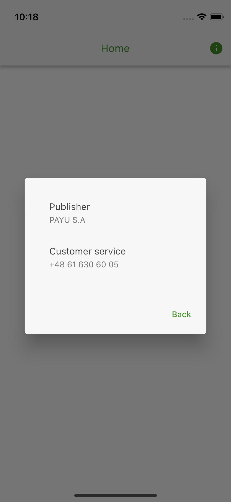

## Features

Flutter package with Payu About dialog which displays:
- [ ] version
- [x] publisher
- [x] customer service

## Getting started

This package should not be used directly by the merchants.

## Usage

```dart
import 'package:flutter/material.dart';

import 'package:payu/payu.dart';

void main() {
  Payu.debug = true;
  Payu.locale = const Locale('en');
  Payu.environment = Environment.sandbox;
  Payu.pos = const POS(id: '300746');

  runApp(
    const MaterialApp(
      home: HomePage(),
    ),
  );
}

class HomePage extends StatelessWidget {
  const HomePage({Key? key}) : super(key: key);

  @override
  Widget build(BuildContext context) {
    return Theme(
      data: Payu.theme,
      child: Scaffold(
        appBar: AppBar(
          title: const Text('Home'),
          actions: [
            IconButton(
              onPressed: () => showDialog(
                context: context,
                builder: (context) => const AboutPage(),
              ),
              icon: const Icon(Icons.info),
            ),
          ],
        ),
      ),
    );
  }
}

```

## Screenshots



## Additional information

TODO: Tell users more about the package: where to find more information, how to 
contribute to the package, how to file issues, what response they can expect 
from the package authors, and more.