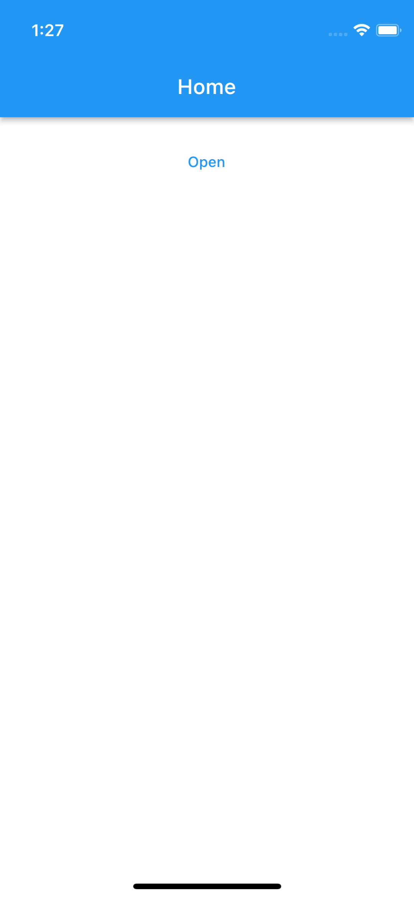
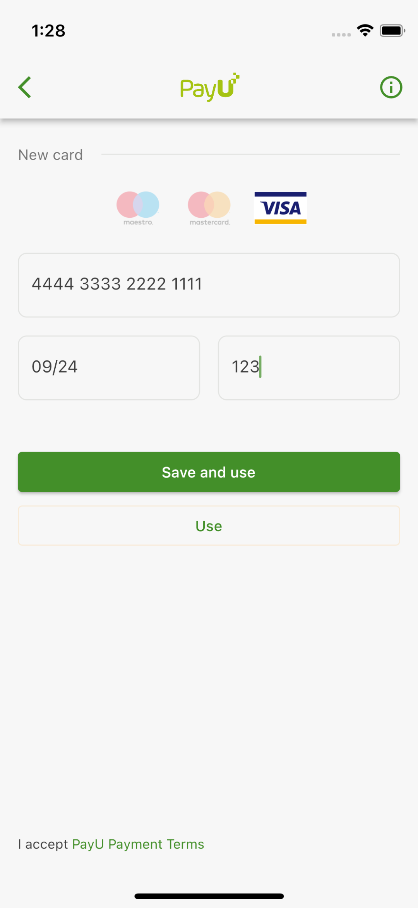
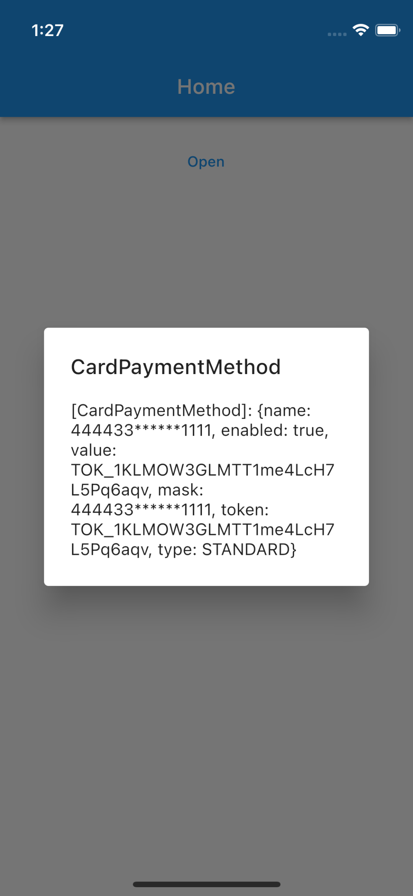
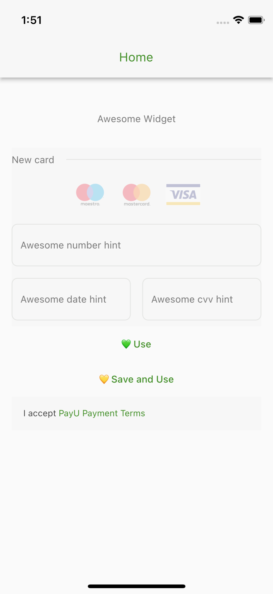
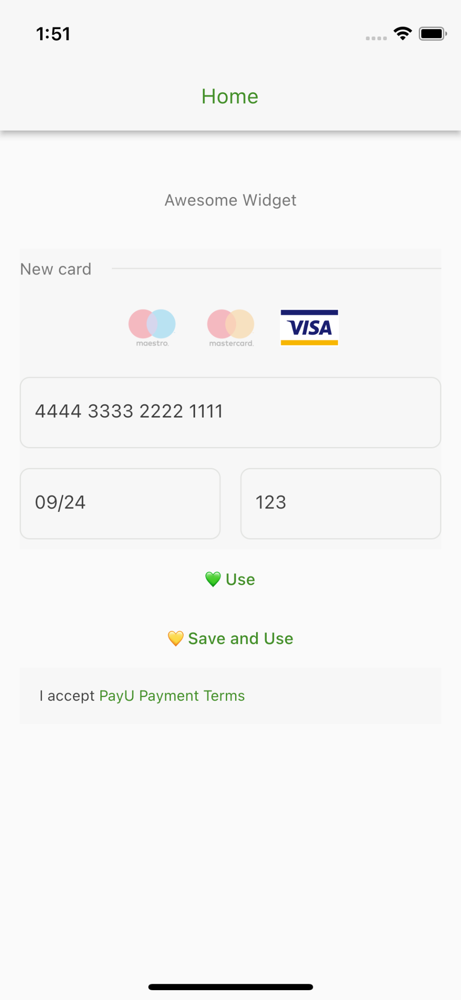
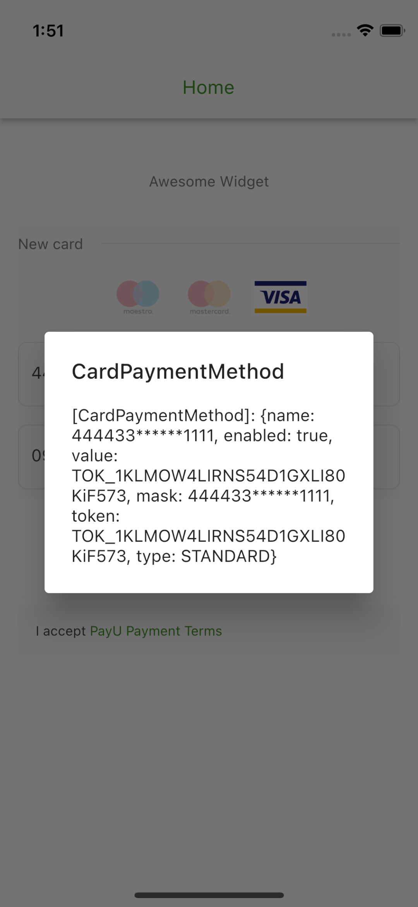

## Features

Flutter package which allows to tokenize cards via Payu.

* [AddCardService](#add_card_service)
* [AddCardPage](#add_card_page)
* [AddCardWidget](#add_card_widget)

## Getting started

Card tokenization service is based on a transparent integration type which allows to accept card payments without redirecting users to a page hosted by the payment service provider. This integration type retains the security level and minimizes the PCI DSS compliance effort. It is also meant to give you more flexibility and increase conversion rates through better control over the payment process.

A payment flow is based on two steps - capturing card credentials in a secure way (front-end process) and then using them to create a payment transaction (back-end process). Card credentials are returned in the form of a token and a masked card number, therefore the Merchant never receives full card details.

Tokens received from PayU can be either single-use or multi-use. Multi-use tokens can be stored and used for future payments. Typically such functionality can be used by e.g. a merchant who has an extensive database of returning users – linking a user account with a multi-use token improves user experience, because the user no longer needs to enter card data each time.

For more detailed documentation please visit [developers.payu.com](https://developers.payu.com/en/card_tokenization.html)

## Usefull links

* [Integration overview](https://developers.payu.com/en/card_tokenization.html#integration)
* [Sandbox cards](https://developers.payu.com/en/overview.html#sandbox_cards)

<a id="add_card_service"></a> 

## AddCardService

Allows merchants to `tokenize` cards. This service should not be used separately. Recommended to use with `AddCardWidget.`

<a id="add_card_page"></a> 

## AddCardPage

This class allows to present the page with the `AddCardWidget` and predefined actions. The result of tokenization is `CardPaymentMethod` - tokenized card data. 

* [Usage](#add_card_page_usage)
* [Screenshots](#add_card_page_screenshots)

<a id="add_card_page_usage"></a>

### Usage

```dart
void main() {
  Payu.pos = const POS(id: '385627');
  Payu.environment = Environment.sandbox;

  runApp(
    const MaterialApp(
      debugShowCheckedModeBanner: false,
      home: HomePage(),
    ),
  );
}

class HomePage extends StatelessWidget {
  const HomePage({Key? key}) : super(key: key);

  @override
  Widget build(BuildContext context) {
    return Scaffold(
      appBar: AppBar(
        title: const Text('Home'),
      ),
      body: Padding(
        padding: const EdgeInsets.all(16.0),
        child: Center(
          child: Column(
            children: [
              TextButton(
                onPressed: () => _openAddCardPage(context),
                child: const Text('Open'),
              ),
            ],
          ),
        ),
      ),
    );
  }
}

void _openAddCardPage(BuildContext context) async {
  final result = await Navigator.of(context).push<CardPaymentMethod>(
    MaterialPageRoute(
      builder: (context) => const AddCardPage(),
    ),
  );

  showDialog(
    context: context,
    builder: (context) => AlertDialog(
      title: const Text('CardPaymentMethod'),
      content: Text(result.toString()),
    ),
  );
}
```

<a id="add_card_page_screenshots"></a>

### Screenshots 

|  |  |  |
| ----------- | ----------- | ----------- |
||||

<a id="add_card_widget"></a> 

## AddCardWidget

This class allows merchants to add prepared card widget to their own pages. The main difference from `AddCardPage` is that it allows to customize widget presentation style properties, such as: `hintText`, etc. For more details please take a look on `AddCardWidgetConfiguration` class.

* [Usage](#add_card_widget_usage)
* [Screenshots](#add_card_widget_screenshots)

<a id="add_card_widget_usage"></a>

### Usage

```dart
void main() {
  Payu.debug = true;
  Payu.locale = const Locale('en');
  Payu.environment = Environment.sandbox;
  Payu.pos = const POS(id: '300746');

  runApp(
    const MaterialApp(
      debugShowCheckedModeBanner: false,
      home: HomePage(),
    ),
  );
}

class HomePage extends StatefulWidget {
  const HomePage({Key? key}) : super(key: key);

  @override
  State<HomePage> createState() => _HomePageState();
}

class _HomePageState extends State<HomePage> {
  late AddCardService _service;

  @override
  Widget build(BuildContext context) {
    return Theme(
      data: Payu.theme,
      child: Scaffold(
        appBar: AppBar(
          title: const Text('Home'),
        ),
        body: SingleChildScrollView(
          child: Padding(
            padding: const EdgeInsets.all(16.0),
            child: Column(
              crossAxisAlignment: CrossAxisAlignment.center,
              children: [
                const Padding(
                  padding: EdgeInsets.all(32),
                  child: Text('Awesome Widget'),
                ),
                AddCardWidget(
                  configuration: AddCardWidgetConfiguration(
                    cvvDecoration: const AddCardWidgetTextInputDecoration(
                      hintText: 'Awesome cvv hint',
                    ),
                    dateDecoration: const AddCardWidgetTextInputDecoration(
                      hintText: 'Awesome date hint',
                    ),
                    numberDecoration: const AddCardWidgetTextInputDecoration(
                      hintText: 'Awesome number hint',
                    ),
                    isFooterVisible: false,
                  ),
                  onCreated: (service) => _service = service,
                ),
                TextButton(
                  onPressed: () => _tokenize(false),
                  child: const Text('💚 Use'),
                ),
                TextButton(
                  onPressed: () => _tokenize(true),
                  child: const Text('💛 Save and Use'),
                ),
                const TermsAndConditionsWidget(),
              ],
            ),
          ),
        ),
      ),
    );
  }

  void _tokenize(bool save) async {
    final result = await _service.tokenize(false);

    showDialog(
      context: context,
      builder: (context) => AlertDialog(
        title: const Text('CardPaymentMethod'),
        content: Text(result.toString()),
      ),
    );
  }
}
```

<a id="add_card_widget_screenshots"></a>

### Screenshots 

|  |  |  |
| ----------- | ----------- | ----------- |
||||


## Additional information

TODO: Tell users more about the package: where to find more information, how to 
contribute to the package, how to file issues, what response they can expect 
from the package authors, and more.