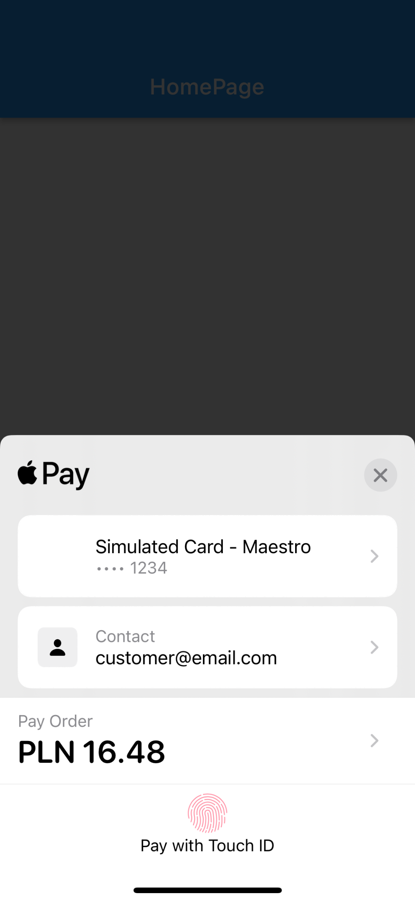
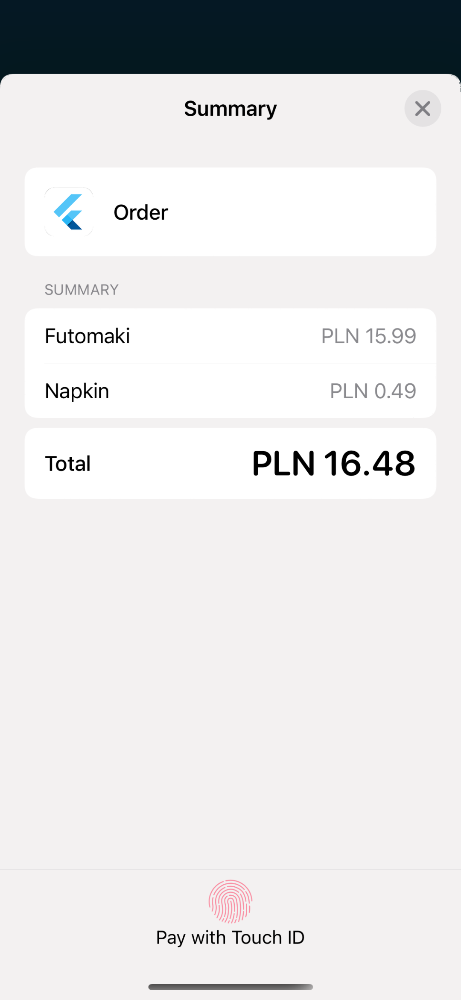

## Features

Flutter package which allows make payments via Apple Pay

* [Configuration](#configuration)
* [Integration](#integration)

## Getting started

Apple Pay™ is a digital wallet which lets you make card payments in a simple and fast manner, without having to enter your card details every time. The card data is securely stored by Apple. This payment method is available for selected browsers and Apple devices (phones and computers). A full list of [supported countries](https://www.apple.com/ios/feature-availability/#apple-pay) and [devices](https://support.apple.com/en-us/HT208531) can be found on the Apple website.

<a id="configuration"></a> 

## Configuration

### Setup

1. [Enable Apple Pay](https://help.apple.com/xcode/mac/current/#/deva43983eb7?sub=dev44ce8ef13)
2. [Create a merchant identifier](https://help.apple.com/developer-account/#/devb2e62b839?sub=dev103e030bb)
3. [Create a payment processing certificate](https://help.apple.com/developer-account/#/devb2e62b839?sub=devf31990e3f)
4. Send created payment processing certificate to `tech@payu.pl`

> When creating an Apple Pay Payment Processing Certificate, you must specify the Key Pair information. Select ECC and 256 bit key pair.

### Sandbox

#### Enable

The Apple Pay payment method is also available in a sandbox environment. In the integration process, we suggest creating an independent Merchant ID (with a name ending “.test”, for example) together with a set of certificates.

Because Apple Pay is not the default payment method, please contact the `tech@payu.pl` after registering in the sandbox environment, but before beginning integration using the Apple Pay payment method. In response you receive also `CSR` file for sandbox environment.

#### Testing

Before beginning to perform tests in the sandbox, please also read the [Apple Pay Sandbox Testing](https://developer.apple.com/apple-pay/sandbox-testing/) instructions.

We recommend using the card numbers since these are configured in the PayU sandbox to enable payments to be completed successfully:

- `5204 2477 5000 1471`
- `4761 1200 1000 0492`

<a id="integration"></a> 

## Integration

### Usage
```dart
import 'package:flutter/material.dart';

import 'package:payu/payu.dart';

void main() {
  Payu.debug = true;
  Payu.locale = const Locale('en');
  Payu.environment = Environment.sandbox;
  Payu.pos = const POS(id: '300746');

  runApp(
    const MaterialApp(
      debugShowCheckedModeBanner: false,
      home: HomePage(),
    ),
  );
}

class HomePage extends StatefulWidget {
  const HomePage({Key? key}) : super(key: key);

  @override
  State<HomePage> createState() => _HomePageState();
}

class _HomePageState extends State<HomePage> implements ApplePayListener {
  late final ApplePayService _service;

  @override
  void initState() {
    _service = ApplePayService.instance();
    _service.setListener(this);
    super.initState();
  }

  @override
  Widget build(BuildContext context) {
    return Scaffold(
      appBar: AppBar(
        title: const Text('HomePage'),
      ),
      body: Center(
        child: TextButton(
          onPressed: () => _didTapPay(),
          child: const Text(' Pay'),
        ),
      ),
    );
  }

  void _didTapPay() async {
    if (await _service.canMakePayments()) {
      await _service.authorize(
        request: const ApplePayPaymentRequest(
          merchantIdentifier: 'merchant.identifier',
          countryCode: 'PL',
          currencyCode: 'PLN',
          shippingContact: ApplePayContact(emailAddress: 'customer@email.com'),
          paymentSummaryItems: [
            ApplePaySummaryItem(label: 'Futomaki', amount: 1599),
            ApplePaySummaryItem(label: 'Napkin', amount: 49),
            ApplePaySummaryItem(label: 'Order', amount: 1599 + 49),
          ],
        ),
      );
    }
  }

  @override
  void onDidAuthorize(String authorizationCode) {
    debugPrint('onDidAuthorize: $authorizationCode');
  }

  @override
  void onDidCancel() {
    debugPrint('onDidCancel');
  }
}
```

### Screenshots

|  |  |  |
| ----------- | ----------- | ----------- |
||||

## Additional information

TODO: Tell users more about the package: where to find more information, how to 
contribute to the package, how to file issues, what response they can expect 
from the package authors, and more.