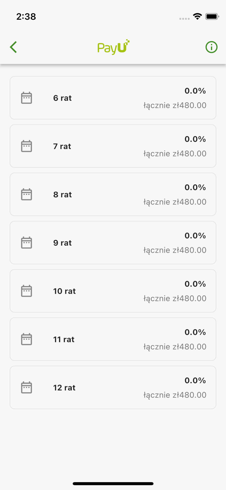
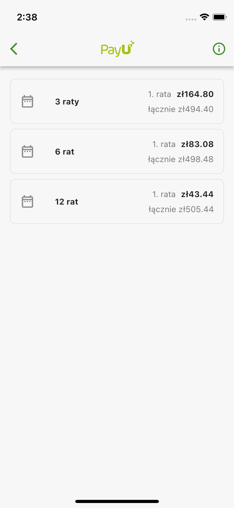

## Features

Flutter package that allows Mastercard card holders to split payments into monthly installments

## Getting started

`Pay in installments with Mastercard` is a service that allows Mastercard card holders to split payments into monthly installments. You can find more details on [mastercard.pl](https://www.mastercard.pl/pl-pl/klient-indywidualny/promocje-i-oferty/raty.html). `Pay in installments with Mastercard` service is enabled by default for all merchants, there are no additional charges to use this service. For more detailed documentation please visit [developers.payu.com](https://developers.payu.com/en/mci.html)

## Usefull links

* [Sandbox cards](https://developers.payu.com/en/overview.html#sandbox_cards)

## Example

* [Usage](#mastercard_installments_usage)
* [Code example](#mastercard_installments_code_example)
* [Screenshots](#mastercard_installments_screenshots)

<a id="mastercard_installments_usage"></a>

### Usage

1. Retreive information about the proposal and build `InstallmentProposal`: 

```dart 
final proposal = InstallmentProposal(...);
```

2. Navigate to `InstallmentsOfferPage`. Payer has 15 minutes to make selection. The `result` of the navigation - is optional `InstallmentResult` model which was selected by the user. If `result` is `null` - user did not select anything. 

```dart
final result = await Navigator.of(context).push<InstallmentResult>(
  MaterialPageRoute(
    builder: (context) => InstallmentsOfferPage(
      proposal: proposal,
    ),
  ),
);
```

<a id="mastercard_installments_code_example"></a>

### Code example

```dart
import 'package:flutter/material.dart';

import 'package:payu/payu.dart';

void main() {
  Payu.debug = true;
  Payu.locale = const Locale('en');
  Payu.environment = Environment.sandbox;
  Payu.pos = const POS(id: '300746');

  runApp(
    const MaterialApp(
      debugShowCheckedModeBanner: false,
      home: HomePage(),
    ),
  );
}

class HomePage extends StatelessWidget {
  const HomePage({Key? key}) : super(key: key);

  @override
  Widget build(BuildContext context) {
    return Theme(
      data: Payu.theme,
      child: Scaffold(
        appBar: AppBar(
          title: const Text('HomePage'),
        ),
        body: Center(
          child: TextButton(
            onPressed: () => _didTapMastercardInstallments(context),
            child: const Text('Mastercard Installments'),
          ),
        ),
      ),
    );
  }

  void _didTapMastercardInstallments(BuildContext context) async {
    final result = await Navigator.of(context).push<InstallmentResult>(
      MaterialPageRoute(
        builder: (context) => InstallmentsOfferPage(
          proposal: _buildInstallmentProposal(),
        ),
      ),
    );

    debugPrint(result?.toString() ?? 'null');
  }

  InstallmentProposal _buildInstallmentProposal() {
    return const InstallmentProposal(
      id: '2bd92572-d32f-4aa8-b486-be51629811e5',
      cardScheme: 'MC',
      installmentOptionFormat: InstallmentOptionFormat.varyingNumberOfOptions,
      currencyCode: 'PLN',
      installmentOptions: [
        InstallmentOption(
          id: '1',
          interestRate: 5.4,
          installmentFeeAmount: 1000,
          annualPercentageRate: 17.93,
          totalAmountDue: 49440,
          firstInstallmentAmount: 16480,
          installmentAmount: 16480,
          numberOfInstallments: 3,
        ),
        InstallmentOption(
          id: '2',
          interestRate: 5.2,
          installmentFeeAmount: 1100,
          annualPercentageRate: 13.05,
          totalAmountDue: 49848,
          firstInstallmentAmount: 8308,
          installmentAmount: 8308,
          numberOfInstallments: 6,
        ),
        InstallmentOption(
          id: '3',
          interestRate: 5,
          installmentFeeAmount: 1200,
          annualPercentageRate: 9.64,
          totalAmountDue: 50544,
          firstInstallmentAmount: 4344,
          installmentAmount: 4200,
          numberOfInstallments: 12,
        ),
      ],
    );
  }
}

```

<a id="mastercard_installments_screenshots"></a>

### Screenshots

|  |  |  |
| ----------- | ----------- | ----------- |
| OFFER | VARYING_NUMBER_OF_INSTALLMENTS | VARYING_NUMBER_OF_OPTIONS |
||||

## Additional information

TODO: Tell users more about the package: where to find more information, how to 
contribute to the package, how to file issues, what response they can expect 
from the package authors, and more.