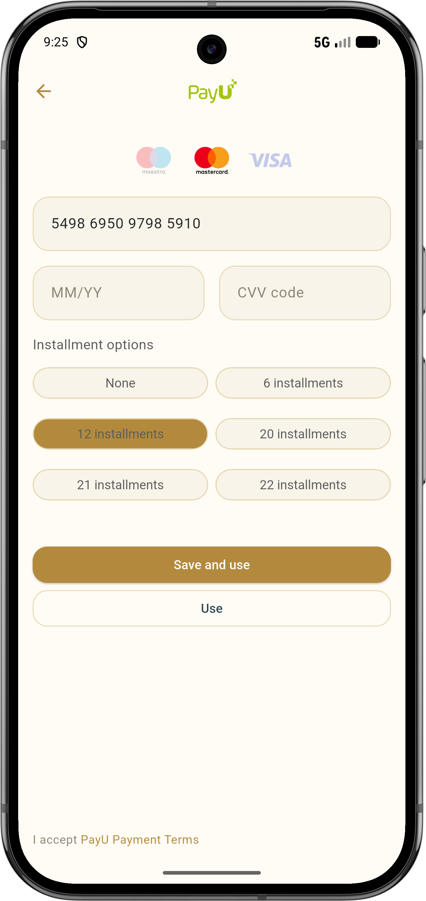
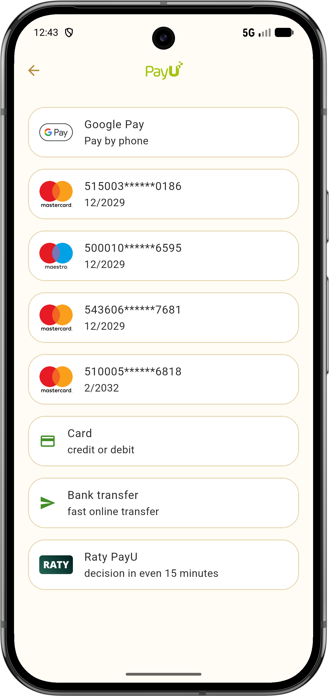
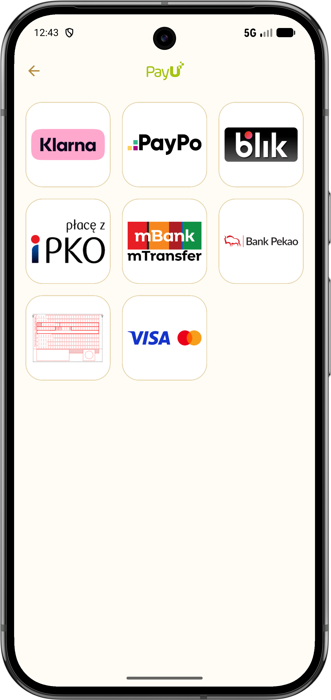
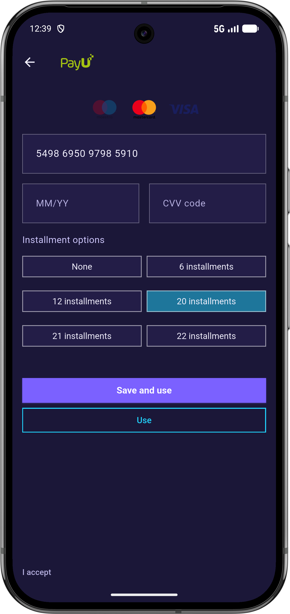
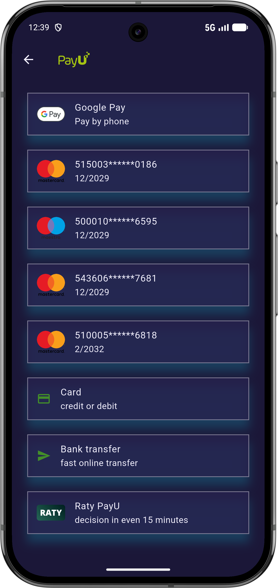
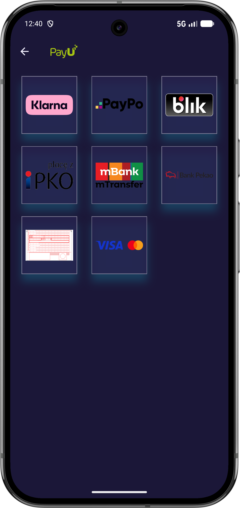

# PayU plugin theme customization

This plugin uses a Material `ThemeData` object available as `Payu.theme`.
Every PayU screen and widget is wrapped by an internal `Theme` widget that injects `Payu.theme`, so all visual customization flows through a single place.

## How to provide a custom theme

```dart
void main() {
  Payu.theme = ThemeData(
    // your custom Material theme here
  );

  runApp(const MyApp());
}
```

- Setting `Payu.theme = null` restores the default PayU theme (`ThemeDataFactory.platform()`).
- The default theme is selected automatically based on the device brightness — light or dark.

## Recommended customization approach

To keep the PayU defaults and change only selected parts, start from the current theme:

```dart
Payu.theme = Payu.theme.copyWith(
  cardTheme: Payu.theme.cardTheme.copyWith(
    color: Colors.white,
  ),
  inputDecorationTheme: Payu.theme.inputDecorationTheme.copyWith(
    floatingLabelBehavior: FloatingLabelBehavior.auto,
  ),
);
```

## PayU brand color palette

The default theme uses the following PayU brand colors (light mode):

| Token | Hex | Usage |
|---|---|---|
| `primary2` | `#438F29` (PayU green) | App bar icons and title, card border accent, `colorScheme.primary` |
| `secondaryGray1` | `#3F3F3F` (dark gray) | Body text, titles |
| `secondaryGray2` | `#777777` (medium gray) | Subtitles, hints, secondary text |
| `secondaryGray3` | `#E3E4E2` (light gray) | Borders, dividers |
| `secondaryGray4` | `#F7F7F7` (very light gray) | Page backgrounds, card fill, dialog fill |
| `tertiary2` | `Colors.red` | Error borders, error text |

> In **dark mode** the gray scale is inverted — `secondaryGray1` becomes the lightest color and
> `secondaryGray4` the darkest — while `primary2` and `tertiary2` remain the same.

## Theme areas and what can be overridden

### `appBarTheme`

Controls the appearance of the top navigation bar shown on full-page screens.

**Default values:**

| Property | Default | Description |
|---|---|---|
| `backgroundColor` | `#F7F7F7` | Background of the app bar |
| `iconTheme.color` | `#438F29` (PayU green) | Color of the leading (back / close) icon |
| `iconTheme.size` | `24` | Size of the leading icon |
| `actionsIconTheme.color` | `#438F29` (PayU green) | Color of action icons on the right side |
| `actionsIconTheme.size` | `24` | Size of action icons |
| `titleTextStyle` | 18sp, `#438F29` | Style of the app bar title text |

**Features using `appBarTheme`:**
- Add Card — full-page card form with a back button
- Payment Methods — list of available payment methods
- Bank Transfer (PBL) — grid of bank logos
- Web Payments — browser page for redirect payments

---

### `cardTheme`

Controls the appearance of `Card` containers used to display individual payment method rows and bank logo tiles.

**Default values:**

| Property | Default | Description |
|---|---|---|
| `color` | `#F7F7F7` | Card fill color |
| `elevation` | `0` | No drop shadow |
| `shadowColor` | `null` | Shadow is disabled |
| `margin` | `EdgeInsets.all(0)` | No outer spacing (spacing is handled by the parent list) |
| `shape` border color | `#E3E4E2` | 1 px outline border |
| `shape` border radius | `8 px` | Rounded corners |

**Features using `cardTheme`:**
- Payment Methods — each payment method row is a `Card`
- Bank Transfer (PBL) — each bank logo tile is a `Card`

---

### `chipTheme`

Controls the appearance of `ChoiceChip`/`FilterChip` controls used in selectable option groups.

**Default values:**

| Property | Default | Description |
|---|---|---|
| `backgroundColor` | `#F7F7F7` | Unselected chip background |
| `selectedColor` | `#F7F7F7` | Selected chip background (same fill as unselected) |
| `labelStyle` | 12sp, `#3F3F3F` | Chip label text style |
| `side` (default state) | 1 px `#E3E4E2` | Outline for non-selected state |
| `side` (`WidgetState.selected`) | 1 px `#438F29` | Outline accent for selected state |
| `shape` border radius | `8 px` | Rounded chip corners |

The selected outline color is state-aware and resolved through `WidgetStateBorderSide.resolveWith`.

**Features using `chipTheme`:**
- Add Card Widget — installment option chips (`ChoiceChip`)

---

### `dialogTheme`

Controls the appearance of overlay dialogs (`AlertDialog`).

**Default values:**

| Property | Default | Description |
|---|---|---|
| `backgroundColor` | `#F7F7F7` | Dialog background |

**Features using `dialogTheme`:**
- Web Payments — "Go back?" confirmation dialog and "Connection not secure" error dialog
- CVV Authorization — dialog asking the user to enter a CVV code
- 3D Secure — dialog showing the 3DS soft-accept flow

---

### `inputDecorationTheme`

Controls the appearance of all text input fields (card number, expiry date, CVV, BLIK code).
All borders use `OutlineInputBorder` with an 8 px corner radius.

**Default values:**

| Property | Default | Description |
|---|---|---|
| `floatingLabelBehavior` | `FloatingLabelBehavior.always` | Label always floats above the field |
| `border` | 1 px `#E3E4E2` outline | Default border state |
| `enabledBorder` | 1 px `#E3E4E2` outline | Border when the field is enabled and not focused |
| `focusedBorder` | 1 px `#E3E4E2` outline | Border when the field has focus |
| `errorBorder` | 1 px red outline | Border when validation fails |
| `focusedErrorBorder` | 1 px red outline | Border when focused and invalid |
| `disabledBorder` | 1 px `#F7F7F7` outline | Border when the field is disabled (nearly invisible) |
| `labelStyle` | 12sp, `#3F3F3F` | Floating label text style |
| `hintStyle` | 14sp, `#777777` | Placeholder text style |
| `helperStyle` | 12sp, `#777777` | Helper text below the field |
| `errorStyle` | 12sp, red | Error message text style |

**Features using `inputDecorationTheme`:**
- Add Card Widget — card number, expiry date, and CVV fields
- Payment Methods Widget — BLIK code entry field
- CVV Authorization — CVV re-entry dialog field

---

### `textTheme`

Controls all text styles. PayU components use only the slots listed below.

**Default values:**

| Slot | Font size | Color | Used in feature                                                                       |
|---|---|---|---------------------------------------------------------------------------------------|
| `bodyLarge` | 16sp | `#3F3F3F` | Installments dropdown selected value and menu item labels in Add Card Widget          |
| `titleSmall` | 14sp | `#777777` | Payment method name and "select payment method" placeholder in Payment Methods Widget |
| `bodyMedium` | 14sp | `#777777` | Payment method description in Payment Methods Widget                                  |
| `bodySmall` | 14sp | `#777777` | Installment validation text style base; Terms & Conditions text                       |

The remaining slots (`titleLarge`, `titleMedium`, `labelLarge`, `labelSmall`) are defined in the default theme but are not currently consumed by any PayU widget.

**Features using `textTheme`:**
- Payment Methods Widget — payment method name and description
- Terms & Conditions Widget — legal disclaimer text

---

### `colorScheme` and `primaryColor`

**Default values:**

| Property | Default | Description |
|---|---|---|
| `colorScheme.primary` | `#438F29` (PayU green) | Arrow icon color in Payment Methods Widget |
| `colorScheme.surface` | `#F7F7F7` | Page and container background color |
| `colorScheme.onSurface` | `#777777` | Default text color on surfaces |
| `colorScheme.error` | red | Error indicator color |
| `colorScheme.onPrimary` | white | Text/icon color on primary-colored backgrounds |
| `primaryColor` | `#438F29` (PayU green) | Link text color in Terms & Conditions Widget |

**Features using `colorScheme` / `primaryColor`:**
- Add Card Page — page background (`colorScheme.surface`)
- Payment Methods Page — page background
- Bank Transfer (PBL) Page — page background
- Payment Methods Widget — container background and arrow icon color
- Terms & Conditions Widget — background and link text color
- Web Payments Page — page background
- Add Card Widget — installment validation text color (`colorScheme.error`)

---

### `ThemeDataFactory.dropdownTextStyle(...)`

`ThemeDataFactory` exposes `dropdownTextStyle(ThemeColorsPallete)` as a convenience style for dropdown content consistency.

**Default value:**

| Property | Default | Description |
|---|---|---|
| `dropdownTextStyle` | `ThemeTextStyles.bodyText1.copyWith(color: secondaryGray1)` | Default text style for dropdown selected value and dropdown menu items |

**Recommended usage:**

```dart
style: Theme.of(context).textTheme.bodyLarge,
```

or, when you build from the palette directly inside theme internals:

```dart
ThemeDataFactory.dropdownTextStyle(palette)
```

---

## Customization examples

The examples below show two completely different looks to illustrate how far the PayU UI can be tailored to your brand. Set `Payu.theme` before calling `runApp`.

---

### Example 1 — Elegant light / premium

An off-white canvas with warm gold accents and deep navy secondary tones. Subtle borders, generous padding, and no elevation for a refined look.





```dart
void main() {
  Payu.theme = ThemeData(
    brightness: Brightness.light,
    chipTheme: ChipThemeData(
      backgroundColor: const Color(0xFFF8F4EA),
      selectedColor: const Color(0xFFB38A3D),
      labelStyle: const TextStyle(color: Color(0xFF5C5C5C)),
      side: WidgetStateBorderSide.resolveWith((states) {
        if (states.contains(WidgetState.selected)) {
          return const BorderSide(color: Color(0xFFE7D7B1), width: 1.2);
        }
        return const BorderSide(color: Color(0xFFE7D7B1), width: 1.2);
      }),
      shape: RoundedRectangleBorder(
        borderRadius: BorderRadius.circular(18),
      ),
    ),
    scaffoldBackgroundColor: const Color(0xFFFCFBF7),
    colorScheme: const ColorScheme.light(
      primary: Color(0xFFB38A3D),
      secondary: Color(0xFF2F4858),
      surface: Color(0xFFFFFCF5),
      onSurface: Color(0xFF2A2A2A),
      error: Color(0xFFC44536),
    ),
    appBarTheme: const AppBarTheme(
      backgroundColor: Color(0xFFFFFCF5),
      foregroundColor: Color(0xFFB38A3D),
      centerTitle: true,
      elevation: 0,
    ),
    cardTheme: CardThemeData(
      color: Colors.white,
      elevation: 0,
      shape: RoundedRectangleBorder(
        borderRadius: BorderRadius.circular(24),
        side: const BorderSide(color: Color(0xFFE7D7B1), width: 1.2),
      ),
    ),
    inputDecorationTheme: InputDecorationTheme(
      filled: true,
      fillColor: const Color(0xFFF8F4EA),
      hintStyle: const TextStyle(color: Color(0xFF8C8577)),
      labelStyle: const TextStyle(color: Color(0xFFB38A3D)),
      contentPadding: const EdgeInsets.symmetric(horizontal: 20, vertical: 18),
      border: OutlineInputBorder(
        borderRadius: BorderRadius.circular(18),
        borderSide: BorderSide.none,
      ),
      enabledBorder: OutlineInputBorder(
        borderRadius: BorderRadius.circular(18),
        borderSide: const BorderSide(color: Color(0xFFE7D7B1)),
      ),
      focusedBorder: OutlineInputBorder(
        borderRadius: BorderRadius.circular(18),
        borderSide: const BorderSide(color: Color(0xFFB38A3D), width: 2),
      ),
      errorBorder: OutlineInputBorder(
        borderRadius: BorderRadius.circular(18),
        borderSide: const BorderSide(color: Color(0xFFC44536)),
      ),
    ),
    textTheme: const TextTheme(
      titleSmall: TextStyle(
        fontSize: 16,
        fontWeight: FontWeight.w600,
        color: Color(0xFF2F4858),
      ),
      bodyMedium: TextStyle(
        fontSize: 15,
        height: 1.4,
        color: Color(0xFF5C5C5C),
      ),
      bodySmall: TextStyle(
        fontSize: 13,
        color: Color(0xFF8C8577),
      ),
    ),
    elevatedButtonTheme: ElevatedButtonThemeData(
      style: ElevatedButton.styleFrom(
        backgroundColor: const Color(0xFFB38A3D),
        foregroundColor: Colors.white,
        shape: RoundedRectangleBorder(
          borderRadius: BorderRadius.circular(16),
        ),
      ),
    ),
    outlinedButtonTheme: OutlinedButtonThemeData(
      style: OutlinedButton.styleFrom(
        foregroundColor: const Color(0xFF2F4858),
        side: const BorderSide(color: Color(0xFFE7D7B1)),
        shape: RoundedRectangleBorder(
          borderRadius: BorderRadius.circular(16),
        ),
      ),
    ),
  );

  runApp(const MyApp());
}
```

---

### Example 2 — Playful gradient / glassmorphism

A very expressive style with a deep gradient base, extra-large rounded corners, strong shadows, vivid accents, custom typography, and bigger paddings.





```dart
void main() {
  Payu.theme = ThemeData(
    useMaterial3: true,
    fontFamily: 'SpaceGrotesk',
    scaffoldBackgroundColor: const Color(0xFF120F2A),
    chipTheme: ChipThemeData(
      backgroundColor: const Color(0x662E275D),
      selectedColor: const Color(0x8021D4FD),
      labelStyle: const TextStyle(color: Color(0xFFF4F2FF)),
      side: WidgetStateBorderSide.resolveWith((states) {
        if (states.contains(WidgetState.selected)) {
          return const BorderSide(color: Color(0x55FFFFFF), width: 1.2);
        }
        return const BorderSide(color: Color(0x55FFFFFF), width: 1.2);
      }),
      shape: RoundedRectangleBorder(
        borderRadius: BorderRadius.circular(0),
      ),
    ),
    colorScheme: const ColorScheme.dark(
      primary: Color(0xFF7B61FF),
      secondary: Color(0xFF21D4FD),
      surface: Color(0xFF1B1738),
      onSurface: Color(0xFFF4F2FF),
      error: Color(0xFFFF5F7A),
    ),
    appBarTheme: AppBarTheme(
      backgroundColor: const Color(0x991B1738),
      foregroundColor: const Color(0xFFF4F2FF),
      centerTitle: false,
      elevation: 0,
      scrolledUnderElevation: 0,
      shape: RoundedRectangleBorder(
        borderRadius: BorderRadius.circular(0),
      ),
      titleTextStyle: const TextStyle(
        fontSize: 22,
        fontWeight: FontWeight.w700,
        letterSpacing: 0.2,
      ),
    ),
    cardTheme: CardThemeData(
      color: const Color(0xCC26214D),
      margin: const EdgeInsets.symmetric(horizontal: 10, vertical: 8),
      elevation: 14,
      shadowColor: const Color(0x8021D4FD),
      shape: RoundedRectangleBorder(
        borderRadius: BorderRadius.circular(0),
        side: const BorderSide(color: Color(0x66FFFFFF), width: 1.2),
      ),
    ),
    dialogTheme: DialogThemeData(
      backgroundColor: const Color(0xFF201A45),
      shape: RoundedRectangleBorder(
        borderRadius: BorderRadius.circular(0),
      ),
    ),
    inputDecorationTheme: InputDecorationTheme(
      filled: true,
      fillColor: const Color(0x662E275D),
      contentPadding: const EdgeInsets.symmetric(horizontal: 22, vertical: 20),
      hintStyle: const TextStyle(color: Color(0xFFB9B3E3), fontSize: 15),
      labelStyle: const TextStyle(
        color: Color(0xFF21D4FD),
        fontSize: 13,
        fontWeight: FontWeight.w600,
      ),
      border: OutlineInputBorder(
        borderRadius: BorderRadius.circular(0),
        borderSide: const BorderSide(color: Color(0x44FFFFFF)),
      ),
      enabledBorder: OutlineInputBorder(
        borderRadius: BorderRadius.circular(0),
        borderSide: const BorderSide(color: Color(0x55FFFFFF)),
      ),
      focusedBorder: OutlineInputBorder(
        borderRadius: BorderRadius.circular(0),
        borderSide: const BorderSide(color: Color(0xFF21D4FD), width: 2.2),
      ),
      errorBorder: OutlineInputBorder(
        borderRadius: BorderRadius.circular(0),
        borderSide: const BorderSide(color: Color(0xFFFF5F7A), width: 1.8),
      ),
    ),
    textTheme: const TextTheme(
      titleSmall: TextStyle(
        fontSize: 17,
        fontWeight: FontWeight.w700,
        color: Color(0xFFF4F2FF),
      ),
      bodyMedium: TextStyle(
        fontSize: 15,
        height: 1.45,
        color: Color(0xFFD0C9FF),
      ),
      bodySmall: TextStyle(
        fontSize: 13,
        fontWeight: FontWeight.w500,
        letterSpacing: 0.1,
        color: Color(0xFFB9B3E3),
      ),
    ),
    elevatedButtonTheme: ElevatedButtonThemeData(
      style: ElevatedButton.styleFrom(
        backgroundColor: const Color(0xFF7B61FF),
        foregroundColor: Colors.white,
        shadowColor: const Color(0xFF7B61FF),
        textStyle: const TextStyle(fontSize: 15, fontWeight: FontWeight.w700),
        shape: RoundedRectangleBorder(
          borderRadius: BorderRadius.circular(0),
        ),
      ),
    ),
    outlinedButtonTheme: OutlinedButtonThemeData(
      style: OutlinedButton.styleFrom(
        foregroundColor: const Color(0xFF21D4FD),
        side: const BorderSide(color: Color(0xFF21D4FD), width: 1.5),
        shape: RoundedRectangleBorder(
          borderRadius: BorderRadius.circular(0),
        ),
      ),
    ),
  );

  runApp(const MyApp());
}
```

---

## Related Flutter documentation

- Material theming overview: https://docs.flutter.dev/cookbook/design/themes
- `ThemeData`: https://api.flutter.dev/flutter/material/ThemeData-class.html
- `ColorScheme`: https://api.flutter.dev/flutter/material/ColorScheme-class.html
- `AppBarTheme`: https://api.flutter.dev/flutter/material/AppBarTheme-class.html
- `CardThemeData`: https://api.flutter.dev/flutter/material/CardThemeData-class.html
- `DialogThemeData`: https://api.flutter.dev/flutter/material/DialogThemeData-class.html
- `ChipThemeData`: https://api.flutter.dev/flutter/material/ChipThemeData-class.html
- `InputDecorationTheme`: https://api.flutter.dev/flutter/material/InputDecorationTheme-class.html
- `TextTheme`: https://api.flutter.dev/flutter/material/TextTheme-class.html

Input filtering (used by PayU text fields together with themed `InputDecoration`):
- `FilteringTextInputFormatter`: https://api.flutter.dev/flutter/services/FilteringTextInputFormatter-class.html
